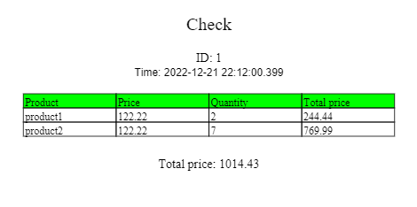

# CLEVERTEC TEST TASK 🌐

## 1 Technologies

* Spring Boot, Java
* PosrgreSQL
* Docker

## 2 How to start application?

1. Clone this repository
2.      cd ${project_folder}
3.     ./gradlew clean build
4.      docker-compose up

## 3 Endpoints

### 3.1 Products

| Method | URL            | Description                                  | Status | Response Type    | Params by default |
|--------|----------------|----------------------------------------------|--------|------------------|-------------------|
| GET    | /products      | Get list of products by page and size params | 200    | Application/JSON | page=0, size=5    |
| GET    | /products/{id} | Get product by id param                      | 200    | Application/JSON | -                 |
| POST   | /products      | Add new product                              | 201    | Application/JSON | -                 | 
| PUT    | /products/{id} | Update product                               | 204    | Application/JSON | -                 | 
| DELETE | /products/{id} | Delete product                               | 204    | -                | -                 |

### 3.1.1 Add new product
#### Request body:
        {
            "name": "name",
            "price": 123.21,
            "promotional": true
        }
#### Response:
        {
            "id": 1
            "name": "name",
            "price": 123.21,
            "promotional": true
        }
### 3.1.2 Update product
#### Request Body:
        {
            "id": 1,
            "name": "name-1",
            "price": 1251.21,
            "promotional": false
        }
#### Response: 204 NO_CONTENT

### 3.2 Discount cards

| Method | URL                   | Description                                        | Status | Response Type    | Params by default |
|--------|-----------------------|----------------------------------------------------|--------|------------------|-------------------|
| GET    | /discountCards        | Get list of discount cards by page and size params | 200    | Application/JSON | page=0, size=5    |
| GET    | /discountCards/{id}   | Get discount card by id param                      | 200    | Application/JSON | -                 |
| POST   | /discountCards        | Add new discount card                              | 201    | Application/JSON | -                 |                

### 3.2.1 Add new discount card
#### Request body:
        {
            "discount": 20
        }
#### Response:
        {
            "id": 1
            "discount": 20
        }
### 3.2.1 Update discount card
#### Request body:
        {
            "id": 1
            "discount": 35
        }
#### Response: 204 NO CONTENT
### 3.3 Checks

| Method | URL                 | Description                                | Status | Response Type    | Params by default |
|--------|---------------------|--------------------------------------------|--------|------------------|-------------------|
| GET    | /checks             | Get list of checks by page and size params | 200    | Application/JSON | page=0, size=5    |
| GET    | /checks/{id}        | Get check by id                            | 200    | Application/JSON | -                 |                
| GET    | /checks/export/{id} | Download check by id in PDF                | 200    | Application/PDF  | -                 |                 
| POST   | /checks             | Create new check                           | 201    | Application/JSON | -                 |                
| DELETE | /checks/{id}        | Delete check by id                         | 204    | -                | -                 |

### 3.3.1 Generate new check
#### Request body:
        {
            "items": 
            [
                {
                    "productId": 1,
                    "quantity": 2
                },
                {
                    "productId": 2,
                    "quantity": 3
                },
                {
                    "productId": 3,
                    "quantity": 4
                }
            ]
            "discountCardId": 3
        }
#### Response: 
        {
            "checkId": 1
            "items": 
            [
                {
                    "id": 1, 
                    "product":
                    {
                        "id": 1,
                        "name": "name-1"
                        "price": 200.00,
                        "promotional": false,
                    },
                    "quantity": 2, 
                    "totalPrice": 400.00
                },
                {
                    "id": 2, 
                    "product":
                    {
                        "id": 1,
                        "name": "name-2"
                        "price": 200.00,
                        "promotional": false,
                    },
                    "quantity": 3, 
                    "totalPrice": 600.00
                },
                {
                    "id": 3, 
                    "product":
                    {
                        "id": 3,
                        "name": "name-3"
                        "price": 200.00,
                        "promotional": false,
                    },
                    "quantity": 4, 
                    "totalPrice": 800.00
                }
            ],
            "discountCard": 
            {
                "id": 3,
                "discount": 20
            },
            "totalPrice": 1440,
            "createdAt": "2022-12-21T18:18:36.165+00:00"
        }
### 3.3.2 Check export

## 4 Database structure
        create table _check (
            id               bigserial      not null,
            created_at       timestamp(6)   not null,
            total_price      numeric(38, 2) not null,
            discount_card_id bigint,
            primary key (id)
        );

        create table discount_card (
            id       bigserial not null,
            discount integer   not null,
            primary key (id)
        );

        create table position (
            id          bigserial      not null,
            quantity    integer        not null,
            total_price numeric(38, 2) not null,
            check_id    bigint,
            product_id  bigint         not null,
            primary key (id)
        );

        create table product (
            id          bigserial      not null,
            name        varchar(255)   not null,
            price       numeric(40, 2) not null,
            promotional boolean        not null,
            primary key (id)
        );

        alter table if exists _check
            add constraint fk_discount_card_id
            foreign key (discount_card_id)
            references discount_card;

        alter table if exists position
            add constraint fk_check_id
            foreign key (check_id)
            references _check;

        alter table if exists position
            add constraint fk_product_id
            foreign key (product_id)
            references product;
## 5. Caching
#### In this project, caching is implemented using a custom in-memory cache using LRU and LFU algorithms.
#### Caches are represented by two classes: LFUCache and LRUCache.
#### Both classes implement the Cache<K, V> interface, where K is a typed parameter for the cache entry key, and V is the value of the cache entry.
#### Each cache has three methods:
*        boolean put(K key, V value)
*        Optional<V> get(K key)
*        boolean remove(K key)
#### More information about cache methods can be found in the javadoc of the Cache<K, V> interface.
#### [Cache replacement policies - Wikipedia](https://en.wikipedia.org/wiki/Cache_replacement_policies)

